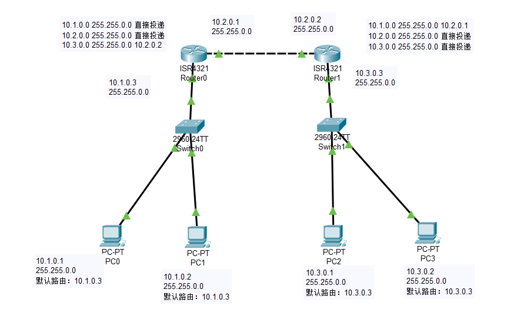
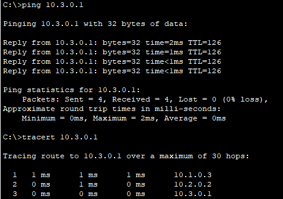

<h1 align='center'>南 开 大 学</h1>

<h2 align='center'>计算机学院

<h3 align='center'>网络技术与应用课程报告

---

<h4 align='center'>第4次实验报告

​    

---

<h4 align='center'>学号：2010519 姓名：卢麒萱 年级：2020 专业：计算机科学与技术

<h3 align='center'>第1节 实验内容说明

- 实体环境下互联网组网与路由器配置 

  在实体环境下完成互联网组网与路由器配置，要求如下： 

  （1）在机房实验室环境下，通过将局域网划分为不同子网，用多IP主机作为路由器，组建互联网。

  （2）在命令行方式下，按照静态路由方式，配置路由器和主机，测试互联网的连通性。

- 仿真环境下的互联网组网与路由器配置

  在仿真环境下完成互联网组网与路由器配置，要求如下：

  （1）学习路由器的配置方法和配置命令。

  （2）参考实体实验，组建由多个路由器组成的互联网。物理网络可以由集线器、交换机构成。

  （3）按照静态路由方式配置路由器和主机，测试互联网的连通性。

  （4）利用动态路由方式配置路由器和主机，测试互联网的连通性。

  （5）在仿真环境的“模拟”方式中观察数据包在互联网中的传递过程，并进行分析。

<h3 align='center'>第2节 实验准备

**实体环境下互联网组网与路由器配置**

实验由四台设备`A、B、R1、R2`组成，其中`A、B`为测试连通性的主机，`R1、R2`为路由器。

配置各设备IP地址及路由如下：

- 主机`A`

  IP：10.11.0.111

  掩码：255.255.0.0

  默认路由：10.11.0.222

- 主机`B`

  IP：10.33.0.222

  掩码：255.255.0.0

  默认路由：10.33.0.111

- 路由器`R1`

  IP1：10.11.0.222	掩码1：255.255.0.0

  IP2：10.22.0.222	掩码2：255.255.0.0

  路由：10.33.0.0 255.255.0.0 10.22.0.111

- 路由器`R2`

  IP1：10.22.0.111	掩码1：255.255.0.0

  IP2：10.33.0.111	掩码2：255.255.0.0

  路由：10.11.0.0 255.255.0.0 10.22.0.222

分析配置可知，当主机`A`尝试`ping`主机`B`时，首先通过默认路由将数据包发送至路由器`R1`的`IP1`端，查询路由表通往网络`10.33.0.0`的网络的下一跳为`10.22.0.111`，因此将数据包由路由器`R1`的`IP2`端转发至路由器`R2`的`IP1`端，而路由器`R2`的`IP2`端出口即为网络`10.33.0.0`，便能将数据包直接发送到主机`B`，完成通路。

**仿真环境下的互联网组网与路由器配置**

配置各设备IP地址及路由如下：

- 主机`PC0`

  IP：10.1.0.1

  掩码：255.255.0.0

  默认路由：10.1.0.3

- 主机`PC1`

  IP：10.1.0.2

  掩码：255.255.0.0

  默认路由：10.1.0.3

- 主机`PC2`

  IP：10.3.0.1

  掩码：255.255.0.0

  默认路由：10.3.0.3

- 主机`PC3`

  IP：10.3.0.2

  掩码：255.255.0.0

  默认路由：10.3.0.3

- 路由器`R0`

  IP1：10.1.0.3	掩码1：255.255.0.0

  IP2：10.2.0.1	掩码2：255.255.0.0

  路由：10.3.0.0 255.255.0.0 10.2.0.2

- 路由器`R1`

  IP1：10.2.0.2	掩码1：255.255.0.0

  IP2：10.3.0.3	掩码2：255.255.0.0

  路由：10.1.0.0 255.255.0.0 10.2.0.1

分析配置可知上图分为三个网络，通过路由器`R0`和`R1`在网络`10.1.0.0`和`10.3.0.0`之间进行转发。原理与实体环境实验相同。

<h3 align='center'>第3节 实验结果
**实体环境下，主机`A`对主机`B`发送`ping`命令：**

**仿真环境下，主机`PC0`对主机`PC2`发送`ping`命令：**

符合路由分析，实验完成。