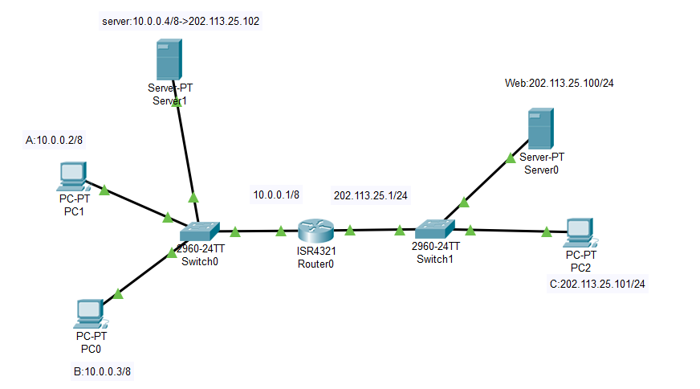
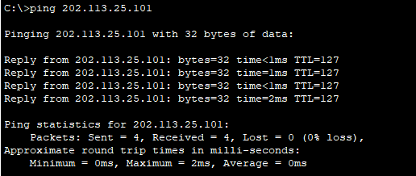
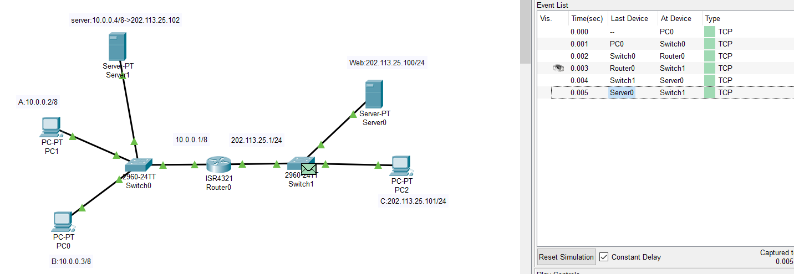
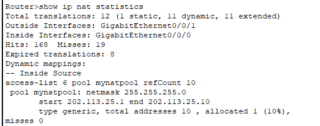
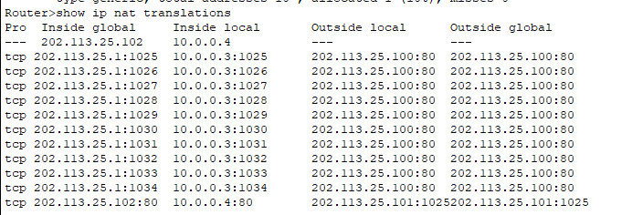
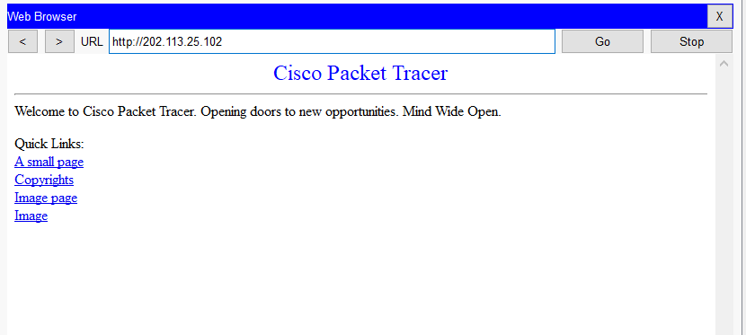
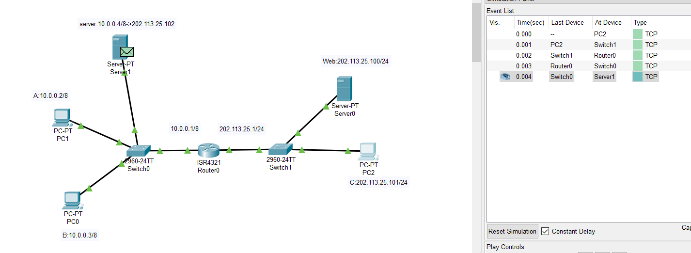
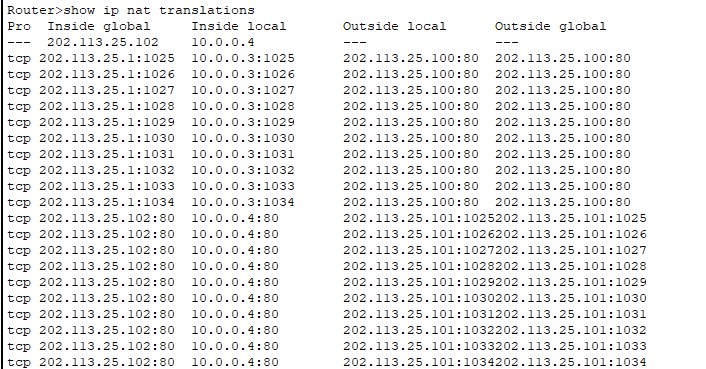

<h1 align='center'>南 开 大 学</h1><br><br>

<h2 align='center'>计算机学院<br><br><br>


<h3 align='center'>网络技术与应用课程报告


---


<h4 align='center'>第6次实验报告


​    

---


<h4 align='center'>学号：2010519</br>姓名：卢麒萱</br>年级：2020</br>专业：计算机科学与技术


<h3 align='center'>第1节 实验内容说明

- 仿真环境下的NAT服务器配置

  在仿真环境下完成NAT服务器的配置实验，要求如下：

  （1）学习路由器的NAT配置过程。

  （2）组建由NAT连接的内网和外网。

  （3）测试网络的连通性，观察网络地址映射表。

  （4）在仿真环境的“模拟”方式中观察IP数据报在互联网中的传递过程，并对IP数据报的地址进行分析。

-  在仿真环境下完成如下实验

  将内部网络中放置一台Web服务器，请设置NAT服务器，使外部主机能够顺利使用该Web服务。

<h3 align='center'>第2节 实验准备


**基础配置过程**

实验由七台设备`PC0、PC1、PC2、Server1、Server0、S0、S1、R0`组成，其中`PC0、PC1`为内网主机，`PC2`为外网主机，`R0`为路由器，`Server1`为内网服务器，`Server0`为外网服务器，`S0、S1`为集线器。拓扑结构如下：



配置各设备端口IP地址及路由如下：

- 主机`PC0`

  IP：10.0.0.3/8

  默认网关：10.0.0.1/8

- 主机`PC1`

  IP：10.0.0.2/8

  默认网关：10.0.0.1/8

- 路由器`R0`

  IP1：10.0.0.1/8

  IP2：202.113.25.1/24

- 主机`PC2`

  IP：202.113.25.101/24

  默认网关：202.113.25.1/24

- 服务器`Server1`

  内网IP：10.0.0.4/8

  映射IP：202.113.25.102/24

- 服务器`Server0`

  IP：202.113.25.100/24

**路由器的NAT配置过程**

对路由器`R0`配置步骤如下：

- 建立全局使用的NAT地址池，在全局配置模式下进行：

  ```shell
  Router(config)#ip nat pool mynatpool 202.113.25.1 202.113.25.10 netmask 255.255.255.0
  ```

  创建了一个名为`mynatpool`，地址范围为`202.113.25.1-202.113.25.10`。

- 建立标准控制列表指定内部网络使用的IP地址，在全局配置模式下进行：

  ```shell
  Router(config)#access-list 6 permit 10.0.0.0 0.255.255.255
  ```

  创建了序号为`6`的访问控制列表，允许`10`开始的地址进行NAT转换，注意此处的通配符与掩码相反，能够改变的位为1，不能改变的位为0。

- 建立地址池与访问控制列表的关联，在全局配置模式下进行：

  ```sh
  Router(config)#nat inside source list 6 pool mynatpool overload
  ```

  将序号为`6`的访问控制列表与名为`mynatpool`的地址池关联，`overload`表示使用的端口转换方法是`NAPT`。

- 进入接口配置模式，指定路由器内外端口：

  ```sh
  Router(config)#interface gig0/0
  Router(config-if)#ip nat inside
  Router(config-if)#exit
  Router(config)#interface gig0/1
  Router(config-if)#ip nat outside
  Router(config-if)#exit
  ```

  指定路由器`0`号端口为连接内部网络的端口，`1`号端口为连接外部网络的端口。

- 配置静态NAT，将内部服务器地址映射为外部可访问的公共地址：

  ```sh
  Router(config)#ip nat inside source static 10.0.0.4 202.113.25.102
  ```

<h3 align='center'>第3节 实验结果

**仿真环境下，主机`PC0`对主机`PC2`发送`ping`命令：**



可以`ping`通。

**仿真环境下，主机`PC0`对主机`Server0`进行访问：**


内网访问外网服务器页面成功。

通过模拟模式可以可视化地看到数据包传递过程：



点击浏览页面的过程就是发送`TCP`报文的过程，可以在`R0`中特权模式下查看`NAT`对`TCP`报文的转发情况的统计信息：

```sh
Router#show ip nat statistics
```



```sh
Router#show ip nat translations
```



可以查看到所有地址转换信息，该转换信息是动态进行的。

**仿真环境下，主机`PC2`对主机`Server1`进行访问：**



外网访问内网服务器页面成功。

通过模拟模式可视化看到数据包转发过程：



点击访问后，再次进入`R0`查看地址转发情况：



下面多出的部分则为静态转换，将`202.113.25.102`固定映射为`10.0.0.4`。