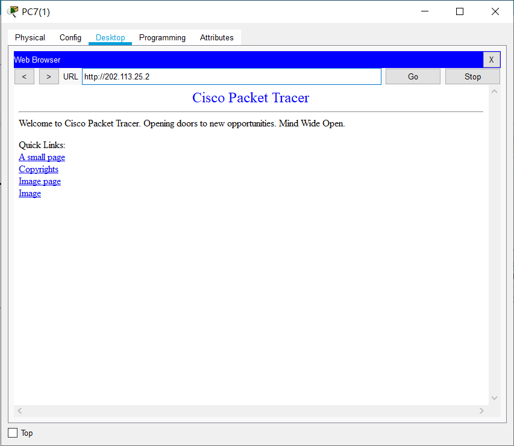

<h1 align='center'>南 开 大 学</h1><br><br>

<h2 align='center'>计算机学院<br><br><br>


<h3 align='center'>网络技术与应用课程报告


---


<h4 align='center'>第7次实验报告


​    

---


<h4 align='center'>学号：2010519</br>姓名：卢麒萱</br>年级：2020</br>专业：计算机科学与技术


<h3 align='center'>第1节 实验内容说明

- 防火墙实验

  防火墙实验在虚拟仿真环境下完成，要求如下：

  （1）了解包过滤防火墙的基本配置方法、配置命令和配置过程。

  （2）利用标准ACL，将防火墙配置为只允许某个网络中的主机访问另一个网络。

  （3）利用扩展ACL，将防火墙配置为拒绝某个网络中的某台主机访问网络中的Web服务器。

  （4）将防火墙配置为允许内网用户自由地向外网发起TCP连接，同时可以接收外网发回的TCP应答数据包。但是，不允许外网的用户主动向内网发起TCP连接。

<h3 align='center'>第2节 实验准备


**基础配置过程**

实验由14台设备组成，其中`PC0、PC2、PC9`为网络`A`主机，`PC7、PC8`为网络`B`主机，`PC5、PC6`为网络`C`主机。拓扑结构如下：


配置各设备端口IP地址及路由如下：

- 主机`PC0`

  IP：202.113.25.1/24

  默认网关：202.113.25.4/24

- 主机`PC2`

  IP：202.113.25.3/24

  默认网关：202.113.25.4/24

- 主机`PC9`

  IP：202.113.25.2/24

  默认网关：202.113.25.4/24

- 主机`PC7`

  IP：202.113.26.1/24

  默认网关：202.113.26.3/24

- 主机`PC8`

  IP：202.113.26.2/24

  默认网关：202.113.26.3/24

- 主机`PC5`

  IP：202.113.27.1/24

  默认网关：202.113.27.3/24

- 主机`PC6`

  IP：202.113.27.2/24

  默认网关：202.113.27.3/24

- 服务器`Server0`

  IP：202.113.25.2/24

  默认网关：202.113.25.4/24

**标准ACL配置过程**

**原理：**利用IP数据报中的源IP地址对过往数据包进行控制，列表号范围：1~99。

**目标：**使网络B中的主机可以自由访问网络A，而其他网络不可访问网络A。

对路由器`R0`配置步骤如下：

- 建立标准控制列表指定能够通过的`IP`地址，在全局配置模式下进行：

  ```shell
  Router(config)#access-list 6 permit 202.113.26.0 0.0.0.255
  ```

  创建了序号为`6`的访问控制列表，允许`202.113.26.0`开始的地址通过，注意此处的通配符与掩码相反，能够改变的位为1，不能改变的位为0。

  再在该ACL中增加一条规则：（可以省略不写）

  ```sh
  Router(config)#access-list 6 deny any
  ```

  拒绝其他所有IP地址通过，达到了仅允许`202.113.26.0`开始的地址通过的目的。

- 进入接口配置模式，将ACL绑定到路由器进入`202.113.26.0`的方向：

  ```sh
  Router(config)#interface gig0/1
  Router(config-if)#ip access-group 6 in
  Router(config-if)#exit
  ```

  将序号为`6`的访问控制列表绑定到路由器`gig0/1`端口进入方向。

**扩展ACL配置过程**

**原理：**按照协议类型、源IP地址、目的IP地址、源端口号、目的端口号对过往数据包进行控制，列表号范围：101~199。

**目的：**不允许IP地址为`202.113.26.2`的主机访问地址为`202.113.25.2`的服务器的Web服务，允许其他任何主机访问。

对路由器`R0`配置步骤如下：

- 建立标准控制列表指定不能够通过的`IP`地址，在全局配置模式下进行：

  ```shell
  Router(config)#access-list 106 deny tcp host 202.113.26.2 host 202.113.25.2 eq 80
  ```

  创建了序号为`106`的访问控制列表，不允许`202.113.26.2`的地址通过`TCP`协议中`80`端口进行访问，`host`为单个主机关键字，`eq`表示等于，注意此处要写明源主机和目的主机。

  再在该ACL中增加一条规则：（不可省略不写）

  ```sh
  Router(config)#access-list 106 permit ip any any
  ```

  允许其他所有IP数据报通过，达到了仅不允许`202.113.26.2`开始的地址通过`TCP`协议访问的目的。

- 进入接口配置模式，将ACL绑定到路由器进入`202.113.26.0`的方向：

  ```sh
  Router(config)#interface gig0/1
  Router(config-if)#ip access-group 106 in
  Router(config-if)#exit
  ```

  将序号为`106`的访问控制列表绑定到路由器`gig0/1`端口进入方向。

<h3 align='center'>第3节 实验结果
#### 标准ACL

**仿真环境下，主机`PC8`对主机`PC2`发送`ping`命令：**


可以`ping`通。

**仿真环境下，主机`PC6`对主机`PC2`发送`ping`命令：**


不可`ping`通，且显示不可达。

#### 扩展ACL

**仿真环境下，主机`PC8`对服务器`Server0`Web页面进行访问：**


页面不可显示，访问失败。

**仿真环境下，主机`PC7`对服务器`Server0`Web页面进行访问：**



页面可显示，访问成功。

**仿真环境下，主机`PC8`对服务器`Server0`发送`ping`命令：**


可以`ping`通，表明路由器只限制了`TCP`协议端口号为`80`的数据报通过。