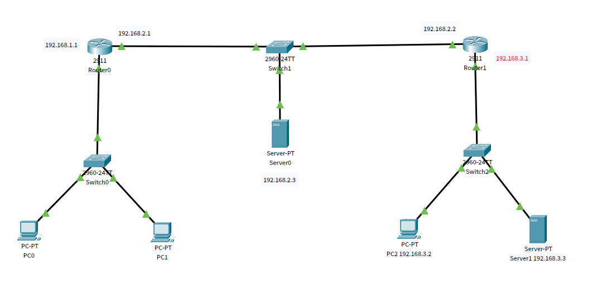
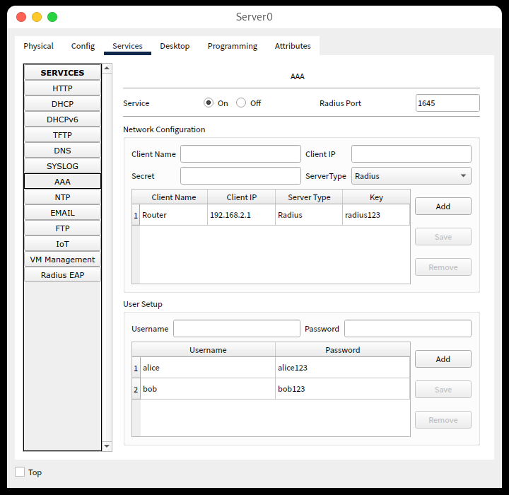
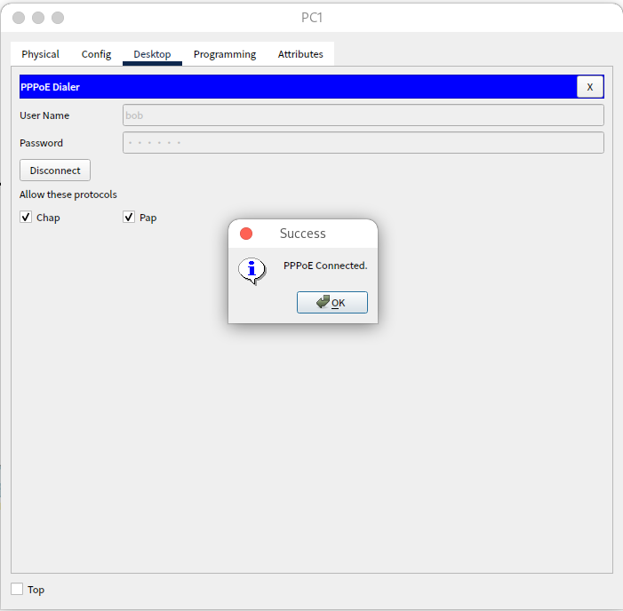
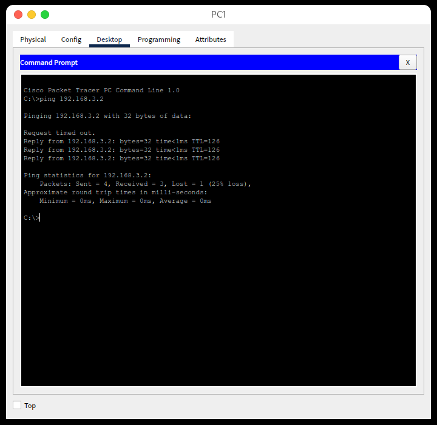
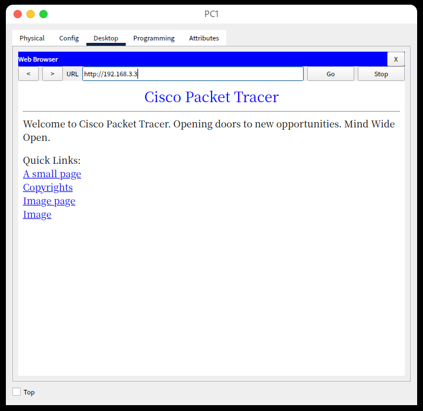

<h1 align='center'>南 开 大 学</h1><br><br>

<h2 align='center'>计算机学院<br><br><br>


<h3 align='center'>网络技术与应用课程报告


---


<h4 align='center'>第8次实验报告


​    

---


<h4 align='center'>学号：2010519</br>姓名：卢麒萱</br>年级：2020</br>专业：计算机科学与技术


<h3 align='center'>第1节 实验内容说明

- PPPoE服务器配置和应用实验在虚拟仿真环境下完成，要求如下：

  仿真有线局域网接入互联网的场景，正确配置PPPoE服务器的认证协议、地址池、虚拟模板和物理接口，使内网用户经认证后才能正常访问外部互联网。

<h3 align='center'>第2节 实验准备


**基础配置过程**

实验由14台设备组成，其中`PC0、PC1`模拟内网主机，`R0`为`PPPoE`服务器，`Server0`为AAA认证服务器，`PC2、Server1`为外网主机。拓扑结构如下：



配置各设备端口IP地址及默认路由如下，主机`PC0`和主机`PC1`IP地址不填写，初始保证模拟外网的主机直接可以相互`ping`通：

- 服务器`Server0`

  IP：192.168.2.3/24

- 主机`PC2`

  IP：192.168.3.2/24

  默认网关：192.168.3.1/24

- 服务器`Server1`

  IP：192.168.3.3/24

  默认网关：192.168.3.1/24

- 路由器`R0`

  IP1：192.168.1.1/24

  IP1：192.168.2.1/24

- 路由器`R1`

  IP1：192.168.2.2/24

  IP1：192.168.3.1/24

####  PPPoE接入服务器的配置

在`R0`路由器上全局模式下进行配置。

**认证方法配置**

```sh
Router(config)#aaa new-model
Router(config)# aaa authentication ppp myPPPoE group radius
Router(config)# radius-server host 192.168.2.3 auth-port 1645 key radius123
```

创建了一个名为`myPPPoE`的使用`radius`协议的认证方式，并且指定了地址为`192.168.2.3`的服务器为`radius-server`，指定了接口和密码。

**AAA服务器配置**

AAA服务器管理着接入的用户账号。



**地址池配置**

```sh
Router(config)# ip local pool myPool 192.168.1.100 192.168.1.200
```

为内网用户创建本地地址池，经过路由器`R0`的自动分配地址`192.168.1.100-192.168.1.200`。

**虚拟模板配置**

```sh
Router(config)#interface virtual-template 1
Router(config-if)#ip unnumbered gig0/0
Router(config-if)#peer default ip address pool myPool
Router(config-if)#ppp authentication chap myPPPoE
Router(config-if)#exit
```

每次用户请求PPPoE服务时创建逻辑接口需使用该模板。

**创建BBA组**

```sh
Router(config)#bba-group pppoe myBBAGroup
Router(config-bba)#virtual-template 1
Router(config-bba)#exit
```

**配置物理接口**

```sh
Router(config)#interface gig0/0
Router(config-if)#pppoe enable group myBBAGroup
Router(config-if)#exit
```

在`gig0/0`接口上启用PPPoE功能。

<h3 align='center'>第3节 实验结果

**验证配置的PPPoE接入服务器**



连接成功。

**仿真环境下，主机`PC1`对主机`PC2`发送`ping`命令：**



可以`ping`通。

**仿真环境下，主机`PC1`对服务器`Server1`Web页面进行访问：**



页面可显示，访问成功。
